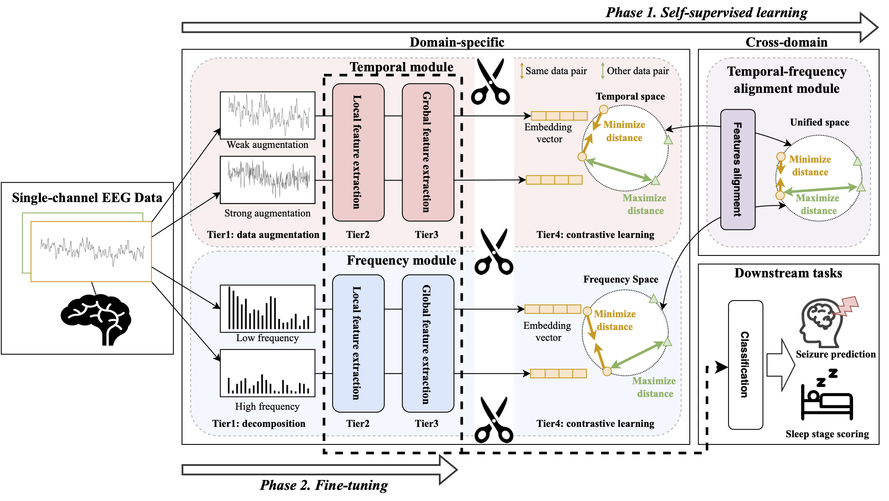

# SplitSEE
SplitSEE: A Splittable Neural Framework for Single-Channel EEG Representation Learning

## Abstract
<p align="center">

</p>

Recognition of informative characteristics from massive, noisy, redundant electroencephalogram (EEG) data usually requires multi-channel modeling or multi-data analytics. 
When provided with a single-channel EEG, how can we effectively extract features that alleviate the constraints of data-intensive processes and are suitable for practical applications, such as low-resource target tasks?
We present SplitSEE, a neural framework tailored for effective Single-channel EEG representation learning. 

The core context of SplitSEE lies in 
- (1) an unsupervised learning neural network to learn various feature representations in different feature domains without label supervision and 
- (2) a pre-training-to-fine-tuning strategy with a structurally Splittable design. 

SplitSEE has the following properties: 
- (a) Generalizability: it can be applicable to various downstream EEG tasks and has even outperformed multi-channel and multi-data source baselines. 
- (b) Effectiveness: it learns informative representations with the capacity to adapt across different EEG electrodes with low variance. 
- (c) Scalability: it achieved high performance across different tasks using a few networks. After the initial pre-training, there is a noticeable enhancement in fine-tuning achieved after just one single-step training iteration. 

## Setup

You can install the required dependencies using pip.

```bash
pip install -r requirements.txt
```

If you're using other than CUDA 11.7, you may need to install PyTorch for the proper version of CUDA. See [instructions](https://pytorch.org/get-started/locally/) for more details.


## Configurations
SplitSEE uses configuration files to manage training parameters for different datasets. 
These configuration files are in the ‘config_files’ folder and named after the corresponding dataset folders. 

For example, for the CHBMIT dataset, the configuration file is named ‘CHBMIT_Configs.py’. 

You can edit these configuration files to change the training parameters.
Changes can include adjustments to learning rates, batch sizes, number of epochs, and other model training parameters.

## Data
Put the data in a folder named 'data'. 
Inside this folder, in the subfolder for each dataset, place 'train.pt', 'val.pt', 'test.pt' files. 

The structure of the data files is a dictionary format like this: train.pt = {"samples": data, "labels": labels}, and similarly for val.pt, test.pt."

This repository includes a small CHBMIT dataset for testing.

## Run
You can select one of several modes:
 - Self-supervised training (self_supervised)
 - Fine-tuning the self-supervised model (fine_tune)
 - Testing the fine-tuned model (test)

You can run an experiment with the test dataset.

This repository includes the weights of the model trained with the CHBMIT dataset as the paper. 
It is not necessary to run self-supervised learning and fine-tuning.

```bash
python main.py --mode test --dataset CHBMIT --channel 0 --device cuda
```

## Result

The experiments are saved in the 'experiments_logs' directory by default (you can change that from args too).